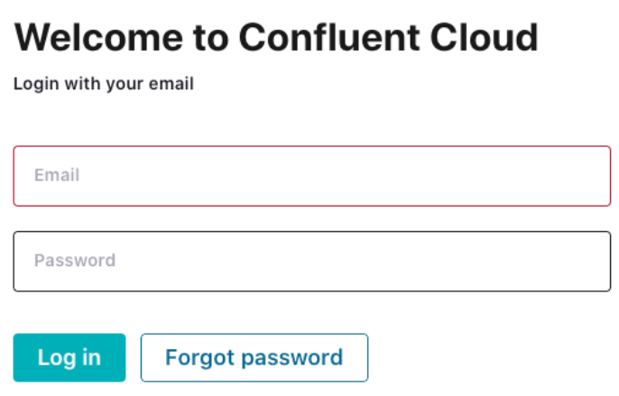

<div align="center" padding=25px>
    
</div>

# <div align="center">Build Real Time Recommendation Pipeline for E-Commerce website</div>
## <div align="center">Lab Guide</div>
<br>

## **Agenda**
1. [Log into Confluent Cloud](#step-1)
2. [Create an Environment and Cluster](#step-2)
3. [Create Flink Compute Pool](#step-3)
4. [Create Topics and walk through Confluent Cloud Dashboard](#step-4)
5. [Create an API Key Pair](#step-5)
6. [Create Datagen Connectors for Shoes orders and clickstream](#step-5)
7. [Create MongoDB Source Connector for shoes and customers details](#step-6)
8. [Stream Processing with Flink for getting trendy products, customer segements, and combine the records into one topic](#step-6)
9. [Consume final topic and recommend shoes to customers](#step-7)
10. [Connect Flink with Gemini](#step-8)
11. [Elasticsearch Monitoring](#step-9)
12. [Clean Up Resources](#step-10)
13. [Confluent Resources and Further Testing](#step-11)
***

## **Prerequisites**
<br>

1. Create a Confluent Cloud Account.
    - Sign up for a Confluent Cloud account [here](https://www.confluent.io/confluent-cloud/tryfree/).
    - Once you have signed up and logged in, click on the menu icon at the upper right hand corner, click on “Billing & payment”, then enter payment details under “Payment details & contacts”. A screenshot of the billing UI is included below.

2. Clone this repo:
   ```
   git clone git@github.com:confluentinc/sts-retail-genai-workshop.git
   ```
   or
   ```
   git clone https://github.com/confluentinc/sts-retail-genai-workshop.git
   ```

3. Install confluent cloud CLI based on your OS (https://docs.confluent.io/confluent-cli/current/install.html)

> **Note:** You will create resources during this workshop that will incur costs. When you sign up for a Confluent Cloud account, you will get free credits to use in Confluent Cloud. This will cover the cost of resources created during the workshop. More details on the specifics can be found [here](https://www.confluent.io/confluent-cloud/tryfree/).

<div align="center" padding=25px>
    
</div>

***

## **Objective**

<br>

Welcome to “Build Real Time Recommendation Pipeline for E-Commerce website”! In this workshop, you will discover how to leverage the capabilities of Confluent Cloud to enable the development of machine learning models using streaming data. We will focus on showcasing how Confluent Cloud, along with Apache Flink and Kafka, can facilitate the creation and deployment of effective data pipelines for real-time analytics.

By the end of this workshop, you'll have a clear understanding of how to utilize Confluent Cloud’s features to build a foundation for machine learning recommendation applications, empowering you to transform your streaming data into valuable product suggestions and gain insights.

<div align="center" padding=25px>
    
</div>

***


## <a name="step-1"></a>Log into Confluent Cloud

1. Log into [Confluent Cloud](https://confluent.cloud) and enter your email and password.

<div align="center" padding=25px>
    
</div>

2. If you are logging in for the first time, you will see a self-guided wizard that walks you through spinning up a cluster. Please minimize this as you will walk through those steps in this workshop. 

***

## <a name="step-2"></a>Create an Environment and Cluster

An environment contains clusters and its deployed components such as Apache Flink, Connectors, ksqlDB, and Schema Registry. You have the ability to create different environments based on your company's requirements. For example, you can use environments to separate Development/Testing, Pre-Production, and Production clusters. 

1. Click **+ Add Environment**. Specify an **Environment Name** and Click **Create**. 

>**Note:** There is a *default* environment ready in your account upon account creation. You can use this *default* environment for the purpose of this workshop if you do not wish to create an additional environment.

<div align="center" padding=25px>
    
</div>

2. Now that you have an environment, click **Create Cluster**. 

> **Note:** Confluent Cloud clusters are available in 5 types: Basic, Standard, Enterprise , Dedicated and Freight. Basic is intended for development use cases so you will use that for the workshop. Basic clusters only support single zone availability. Standard , Enterprise, Dedicated and Freight clusters are intended for production use and support Multi-zone deployments. If you are interested in learning more about the different types of clusters and their associated features and limits, refer to this [documentation](https://docs.confluent.io/current/cloud/clusters/cluster-types.html).

3. Chose the **Basic** cluster type. 

<div align="center" padding=25px>
    
</div>

4. Click **Begin Configuration**. 
5. Choose your preferred Cloud Provider (AWS, GCP, or Azure), region, and availability zone. 
6. Specify a **Cluster Name**. For the purpose of this lab, any name will work here. 

<div align="center" padding=25px>
    
</div>

7. View the associated *Configuration & Cost*, *Usage Limits*, and *Uptime SLA* information before launching. 
8. Click **Launch Cluster**. 

***

## <a name="step-3"></a>Create a Flink Compute Pool

1. On the navigation menu, select **Flink** and click **Create Compute Pool**.

<div align="center" padding=25px>
    
</div>

2. Select **Region** and then **Continue**. (You have to use the region where the cluster was created in the previous step)
<div align="center" padding=25px>
    
</div>

3. Name you Pool Name and set the capacity units (CFUs) to **10**. Click **Finish**.

<div align="center" padding=25px>
    
</div>

> **Note:** The capacity of a compute pool is measured in CFUs. Compute pools expand and shrink automatically based on the resources required by the statements using them. A compute pool without any running statements scale down to zero. The maximum size of a compute pool is configured during creation. 

4. Flink Compute pools will be ready shortly. You can click **Open SQL workspace** when the pool is ready to use.

5. Change your workspace name by clicking **settings button**. Click **Save changes** after you update the workspace name.

<div align="center" padding=25px>
    
</div>

6. Set the Catalog as your environment name.

<div align="center" padding=25px>
    
</div>

7. Set the Database as your cluster name.

<div align="center" padding=25px>
    
</div>

***

## <a name="step-4"></a>Creates Topic and Walk Through Cloud Dashboard

1. On the navigation menu, you will see **Cluster Overview**. 

> **Note:** This section shows Cluster Metrics, such as Throughput and Storage. This page also shows the number of Topics, Partitions, Connectors, and ksqlDB Applications.

2. Click on **Cluster Settings**. This is where you can find your *Cluster ID, Bootstrap Server, Cloud Details, Cluster Type,* and *Capacity Limits*.
3. On the same navigation menu, select **Topics** and click **Create Topic**. 
4. Enter **shoes_orders** as the topic name, **3** as the number of partitions, skip the data contract and then click **Create with defaults**.'

<div align="center" padding=25px>
    
</div>

5. Repeat the previous step and create a second topic name **shoes_clickstream** and **3** as the number of partitions and skip the data contract.

> **Note:** Topics have many configurable parameters. A complete list of those configurations for Confluent Cloud can be found [here](https://docs.confluent.io/cloud/current/using/broker-config.html). If you are interested in viewing the default configurations, you can view them in the Topic Summary on the right side. 

7. After topic creation, the **Topics UI** allows you to monitor production and consumption throughput metrics and the configuration parameters for your topics. When you begin sending messages to Confluent Cloud, you will be able to view those messages and message schemas.

***

## <a name="step-5"></a>Create an API Key

1. Click on the hamburger icon (three horizontal lines) in the top right of the screen.
2. Click **API Keys** in the menu under *Administration*.
3. Click **Create Key** in order to create your first API Key. If you have an existing API Key, click **+ Add Key** to create another API Key.

<div align="center" padding=25px>
    
</div>

4. Select **My account** and then click **Next**.
5. Select **Kafka cluster**, then select your workshop environment and cluster under the *Specify Kafka cluster* dropdowns. Click **Next**.

<div align="center" padding=25px>
    
</div>

6. Give your API Key a name, something like `client-apikey`.
7. Enter a description for your API Key (e.g. `API Key to source data from connectors`).
8. Click **Create API Key**.
9. Click **Download API key** to save both the *Key* and *Secret* to your computer.
10. Click **Complete**.
11. After creating and saving the API key, you will see this API key in the Confluent Cloud UI in the *API Keys* table. If you don't see the API key populate right away, try refreshing your browser.


## <a name="step-6"></a>Create Datagen Connectors for Users and Stocks

The next step is to produce sample data using the Datagen Source connector. You will create two Datagen Source connectors.

The first connector will send sample shoe orders data to the **shoes_orders** topic, while the second connector will send shoes clickstream data to the **shoes_clickstream** topic.

1. First, navigate to your workshop cluster.
2. Next, click on the **Connectors** link on the navigation menu.
3. Now click on the **Datagen Source** icon.

<div align="center" padding=25px>
    
</div>

4. Click the **Additional Configuration** link.
5. Enter the following configuration details in the setup wizard. The remaining fields can be left blank or default.
<div align="center">

| Setting                            | Value                        |
|------------------------------------|------------------------------|
| Topic                              | shoes_orders                 |
| API Key                            | [*from step 5*](#step-5)     |
| API Secret                         | [*from step 5*](#step-5)     |
| Output message format              | AVRO                         |
| Quickstart                         | Shoe orders                  |
| Max interval between messages (ms) | 1000                         |
| Tasks                              | 1                            |
| Name                               | shoe-orders-data-connector   |

</div>

<br>

<div align="center" padding=25px>
    
</div>

6. Continue through the setup wizard and click **Continue** to launch the wizard.

<div align="center" padding=25px>
    
</div>

7. Next, create the second connector that will send data to **shoes_clickstream**. Click on **+ Add Connector** and then the **Datagen Source** icon again.

8. Enter the following configuration details. The remaining fields can be left blank or default.

<div align="center">

| Setting                            | Value                        |
|------------------------------------|------------------------------|
| API Key                            | [*from step 5* ](#step-5)    |
| API Secret                         | [*from step 5* ](#step-5)    |
| Topic                              | shoes_clickstream            |
| Output message format              | AVRO                         |
| Quickstart                         | Shoe clickstream             |
| Max interval between messages (ms) | 1000                         |
| Tasks                              | 1                            |
| Name                               | shoe-clicks-data-connector   |
</div>

<br>

9. Review your selections and then click **Launch**.

> **Note:** It may take a few moments for the connectors to launch. Check the status and when both are ready, the status should show *running*. <br> <div align="center"></div>

> **Note:** If the connector fails, there are a few different ways to troubleshoot the error:
> * Click on the *Connector Name*. You will see a play and pause button on this page. Click on the play button.
> * Click on the *Connector Name*, go to *Settings*, and re-enter your API key and secret. Double check there are no extra spaces at the beginning or end of the key and secret that you may have accidentally copied and pasted.
> * If neither of these steps work, try creating another Datagen connector.


10. You can view the sample data flowing into topics in real time. Navigate to  the **Topics** tab and then click on the **shoes_orders**. You can view the production and consumption throughput metrics here.

11. Click on **Messages**.
12. Click on a row in the table and you should see something like this:

<div align="center">
    
</div>