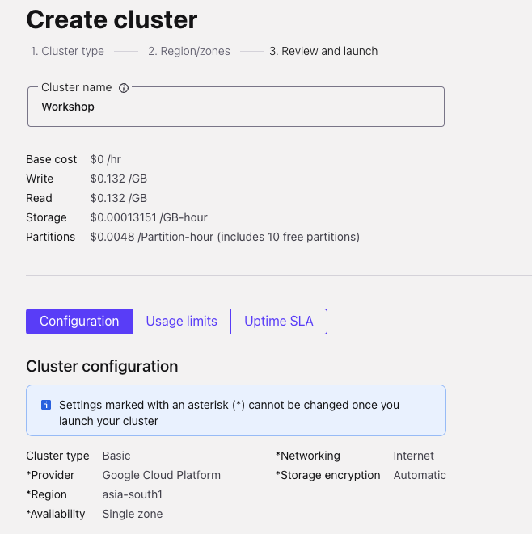
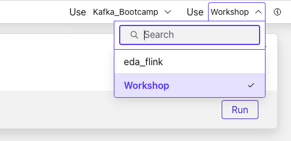

<div align="center" padding=25px>
    
</div>

# <div align="center">Build Real Time Recommendation Pipeline for E-Commerce website</div>
## <div align="center">Lab Guide</div>
<br>

## **Agenda**
1. [Log into Confluent Cloud](#step-1)
2. [Create an Environment and Cluster](#step-2)
3. [Create Flink Compute Pool](#step-3)
4. [Create Topics and walk through Confluent Cloud Dashboard](#step-4)
5. [Create Datagen Connectors for Shoes , customers , orders and clickstream](#step-5)
6. [Perform complex joins using Flink to combine the records into one topic](#step-6)
7. [Consume final topic and recommend shoes to customers](#step-7)
8. [Connect Flink with Gemini](#step-8)
9. [Elasticsearch Monitoring](#step-9)
10. [Clean Up Resources](#step-10)
11. [Confluent Resources and Further Testing](#step-11)
***

## **Prerequisites**
<br>

1. Create a Confluent Cloud Account.
    - Sign up for a Confluent Cloud account [here](https://www.confluent.io/confluent-cloud/tryfree/).
    - Once you have signed up and logged in, click on the menu icon at the upper right hand corner, click on “Billing & payment”, then enter payment details under “Payment details & contacts”. A screenshot of the billing UI is included below.

2. Clone this repo:
   ```
   git clone git@github.com:confluentinc/sts-retail-genai-workshop.git
   ```
   or
   ```
   git clone https://github.com/confluentinc/sts-retail-genai-workshop.git
   ```

3. Install confluent cloud CLI based on your OS (https://docs.confluent.io/confluent-cli/current/install.html)

> **Note:** You will create resources during this workshop that will incur costs. When you sign up for a Confluent Cloud account, you will get free credits to use in Confluent Cloud. This will cover the cost of resources created during the workshop. More details on the specifics can be found [here](https://www.confluent.io/confluent-cloud/tryfree/).

<div align="center" padding=25px>
    
</div>

***

## **Objective**

<br>

Welcome to “Build Real Time Recommendation Pipeline for E-Commerce website”! In this workshop, you will discover how to leverage the capabilities of Confluent Cloud to enable the development of machine learning models using streaming data. We will focus on showcasing how Confluent Cloud, along with Apache Flink and Kafka, can facilitate the creation and deployment of effective data pipelines for real-time analytics.

By the end of this workshop, you'll have a clear understanding of how to utilize Confluent Cloud’s features to build a foundation for machine learning recommendation applications, empowering you to transform your streaming data into valuable product suggestions and gain insights.

<div align="center" padding=25px>
    
</div>

***


## <a name="step-1"></a>Log into Confluent Cloud

1. Log into [Confluent Cloud](https://confluent.cloud) and enter your email and password.

<div align="center" padding=25px>
    
</div>

2. If you are logging in for the first time, you will see a self-guided wizard that walks you through spinning up a cluster. Please minimize this as you will walk through those steps in this workshop. 

***

## <a name="step-2"></a>Create an Environment and Cluster

An environment contains clusters and its deployed components such as Apache Flink, Connectors, ksqlDB, and Schema Registry. You have the ability to create different environments based on your company's requirements. For example, you can use environments to separate Development/Testing, Pre-Production, and Production clusters. 

1. Click **+ Add Environment**. Specify an **Environment Name** and Click **Create**. 

>**Note:** There is a *default* environment ready in your account upon account creation. You can use this *default* environment for the purpose of this workshop if you do not wish to create an additional environment.

<div align="center" padding=25px>
    
</div>

2. Now that you have an environment, click **Create Cluster**. 

> **Note:** Confluent Cloud clusters are available in 5 types: Basic, Standard, Enterprise , Dedicated and Freight. Basic is intended for development use cases so you will use that for the workshop. Basic clusters only support single zone availability. Standard , Enterprise, Dedicated and Freight clusters are intended for production use and support Multi-zone deployments. If you are interested in learning more about the different types of clusters and their associated features and limits, refer to this [documentation](https://docs.confluent.io/current/cloud/clusters/cluster-types.html).

3. Chose the **Basic** cluster type. 

<div align="center" padding=25px>
    
</div>

4. Click **Begin Configuration**. 
5. Choose your preferred Cloud Provider (AWS, GCP, or Azure), region, and availability zone. 
6. Specify a **Cluster Name**. For the purpose of this lab, any name will work here. 

<div align="center" padding=25px>
    
</div>

7. View the associated *Configuration & Cost*, *Usage Limits*, and *Uptime SLA* information before launching. 
8. Click **Launch Cluster**. 

***

## <a name="step-3"></a>Create a Flink Compute Pool

1. On the navigation menu, select **Flink** and click **Create Compute Pool**.

<div align="center" padding=25px>
    
</div>

2. Select **Region** and then **Continue**. (You have to use the region where the cluster was created in the previous step)
<div align="center" padding=25px>
    
</div>

3. Name you Pool Name and set the capacity units (CFUs) to **10**. Click **Finish**.

<div align="center" padding=25px>
    
</div>

> **Note:** The capacity of a compute pool is measured in CFUs. Compute pools expand and shrink automatically based on the resources required by the statements using them. A compute pool without any running statements scale down to zero. The maximum size of a compute pool is configured during creation. 

4. Flink Compute pools will be ready shortly. You can click **Open SQL workspace** when the pool is ready to use.

5. Change your workspace name by clicking **settings button**. Click **Save changes** after you update the workspace name.

<div align="center" padding=25px>
    
</div>

6. Set the Catalog as your environment name.

<div align="center" padding=25px>
    
</div>

7. Set the Database as your cluster name.

<div align="center" padding=25px>
    
</div>

***
