<div align="center" padding=25px>
    
</div>

# <div align="center">Build Real Time Recommendation Pipeline for E-Commerce website</div>
## <div align="center">Lab Guide</div>
<br>

## **Agenda**
1. [Log into Confluent Cloud](#step-1)
2. [Create an Environment and Cluster](#step-2)
3. [Create Flink Compute Pool](#step-3)
4. [Create Topics and walk through Confluent Cloud Dashboard](#step-4)
5. [Create an API Key Pair](#step-5)
6. [Create Datagen Connectors for Shoes orders and clickstream](#step-6)
7. [Create Atlas MongoDB Source Connector for shoes and customers details](#step-7)
8. [Stream Processing with Flink for getting trendy products, customer segements, and combine the records into one topic](#step-8)
9. [Consume final topic and recommend shoes to customers with aws bedrock](#step-9)
10. [Elasticsearch Monitoring](#step-10)
11. [Clean Up Resources](#step-11)
12. [Confluent Resources and Further Testing](#step-12)
***

## **Prerequisites**
<br>

1. Create a Confluent Cloud Account.
    - Sign up for a Confluent Cloud account [here](https://www.confluent.io/confluent-cloud/tryfree/).
    - Once you have signed up and logged in, click on the menu icon at the upper right hand corner, click on “Billing & payment”, then enter payment details under “Payment details & contacts”. A screenshot of the billing UI is included below.

2. Clone this repo:
   ```
   git clone git@github.com:confluentinc/sts-retail-genai-workshop.git
   ```
   or
   ```
   git clone https://github.com/confluentinc/sts-retail-genai-workshop.git
   ```

3. Install confluent cloud CLI based on your OS (https://docs.confluent.io/confluent-cli/current/install.html)

> **Note:** You will create resources during this workshop that will incur costs. When you sign up for a Confluent Cloud account, you will get free credits to use in Confluent Cloud. This will cover the cost of resources created during the workshop. More details on the specifics can be found [here](https://www.confluent.io/confluent-cloud/tryfree/).

<div align="center" padding=25px>
    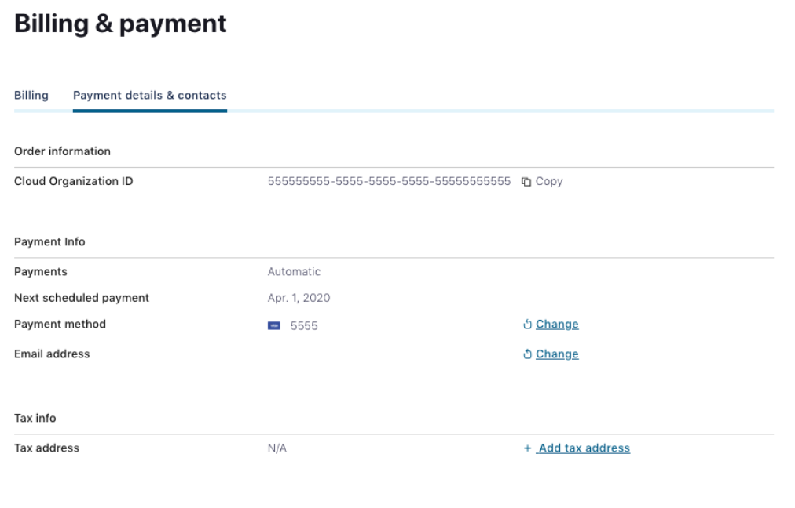
</div>

***

## **Objective**

<br>

Welcome to “Build Real Time Recommendation Pipeline for E-Commerce website”! In this workshop, you will discover how to leverage the capabilities of Confluent Cloud to enable the development of machine learning models using streaming data. We will focus on showcasing how Confluent Cloud, along with Apache Flink and Kafka, can facilitate the creation and deployment of effective data pipelines for real-time analytics.

By the end of this workshop, you'll have a clear understanding of how to utilize Confluent Cloud’s features to build a foundation for machine learning recommendation applications, empowering you to transform your streaming data into valuable product suggestions and gain insights.

<div align="center" padding=25px>
    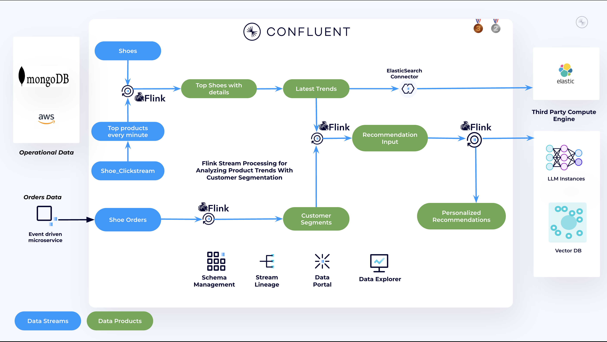
</div>

***


## <a name="step-1"></a>Log into Confluent Cloud

1. Log into [Confluent Cloud](https://confluent.cloud) and enter your email and password.

<div align="center" padding=25px>
    
</div>

2. If you are logging in for the first time, you will see a self-guided wizard that walks you through spinning up a cluster. Please minimize this as you will walk through those steps in this workshop. 

***

## <a name="step-2"></a>Create an Environment and Cluster

An environment contains clusters and its deployed components such as Apache Flink, Connectors, ksqlDB, and Schema Registry. You have the ability to create different environments based on your company's requirements. For example, you can use environments to separate Development/Testing, Pre-Production, and Production clusters. 

1. Click **+ Add Environment**. Specify an **Environment Name** and Click **Create**. 

>**Note:** There is a *default* environment ready in your account upon account creation. You can use this *default* environment for the purpose of this workshop if you do not wish to create an additional environment.

<div align="center" padding=25px>
    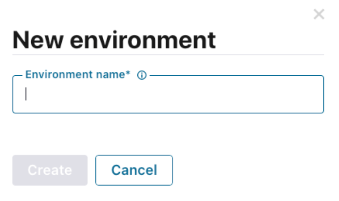
</div>

2. Now that you have an environment, click **Create Cluster**. 

> **Note:** Confluent Cloud clusters are available in 5 types: Basic, Standard, Enterprise , Dedicated and Freight. Basic is intended for development use cases so you will use that for the workshop. Basic clusters only support single zone availability. Standard , Enterprise, Dedicated and Freight clusters are intended for production use and support Multi-zone deployments. If you are interested in learning more about the different types of clusters and their associated features and limits, refer to this [documentation](https://docs.confluent.io/current/cloud/clusters/cluster-types.html).

3. Chose the **Basic** cluster type. 

<div align="center" padding=25px>
    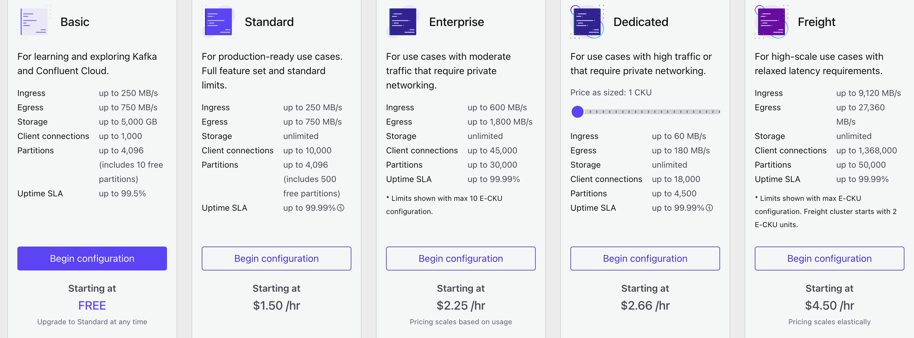
</div>

4. Click **Begin Configuration**. 
5. Choose AWS as preferred Cloud Provider, region (us-east-1), and availability zone. 
6. Specify a **Cluster Name**. For the purpose of this lab, any name will work here. 

<div align="center" padding=25px>
    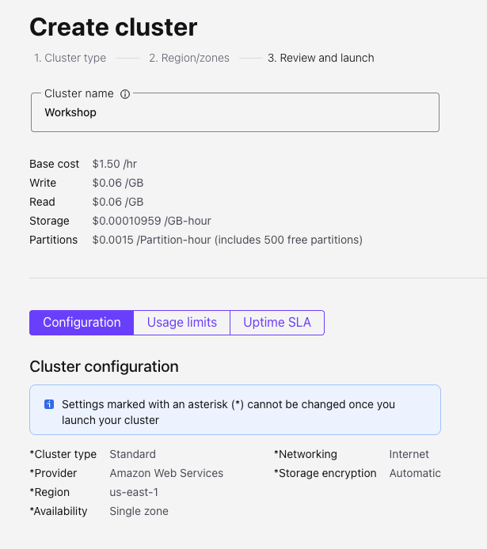
</div>

7. View the associated *Configuration & Cost*, *Usage Limits*, and *Uptime SLA* information before launching. 
8. Click **Launch Cluster**. 

***

## <a name="step-3"></a>Create a Flink Compute Pool

1. On the navigation menu, select **Flink** and click **Create Compute Pool**.

<div align="center" padding=25px>
    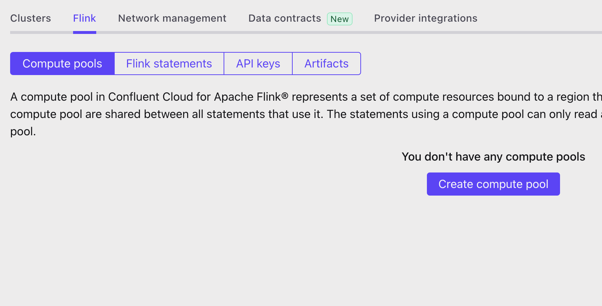
</div>

2. Select **Region** and then **Continue**. (You have to use the region where the cluster was created in the previous step)
<div align="center" padding=25px>
    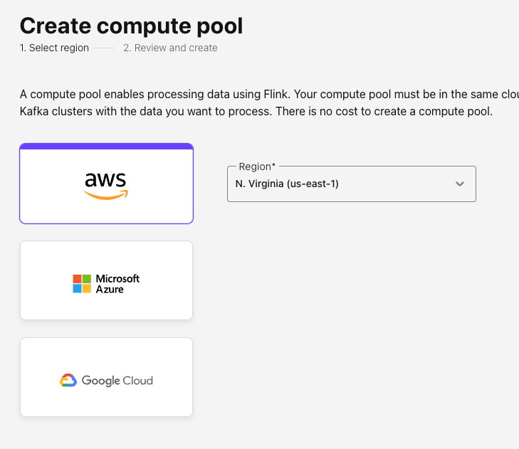
</div>

3. Name you Pool Name and set the capacity units (CFUs) to **10**. Click **Finish**.

<div align="center" padding=25px>
    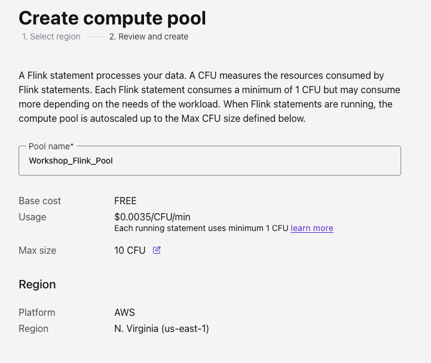
</div>

> **Note:** The capacity of a compute pool is measured in CFUs. Compute pools expand and shrink automatically based on the resources required by the statements using them. A compute pool without any running statements scale down to zero. The maximum size of a compute pool is configured during creation. 

4. Flink Compute pools will be ready shortly. You can click **Open SQL workspace** when the pool is ready to use.

5. Change your workspace name by clicking **settings button**. Click **Save changes** after you update the workspace name.

<div align="center" padding=25px>
    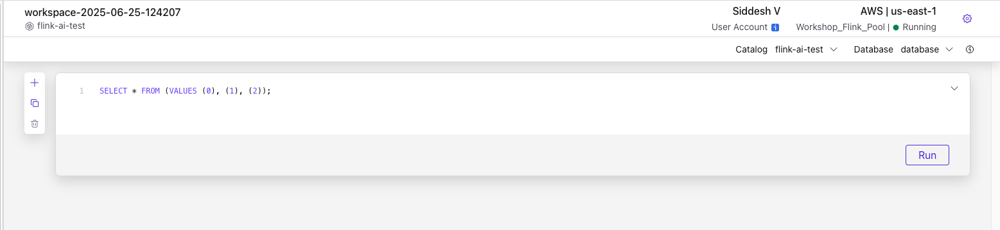
</div>

6. Set the Catalog as your environment name.

<div align="center" padding=25px>
    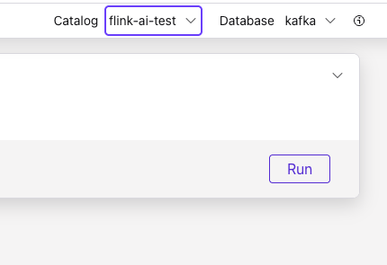
</div>

7. Set the Database as your cluster name.

<div align="center" padding=25px>
    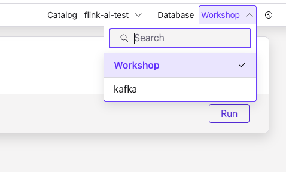
</div>

***

## <a name="step-4"></a>Creates Topic and Walk Through Cloud Dashboard

1. On the navigation menu, you will see **Cluster Overview**. 

> **Note:** This section shows Cluster Metrics, such as Throughput and Storage. This page also shows the number of Topics, Partitions, Connectors, and ksqlDB Applications.

2. Click on **Cluster Settings**. This is where you can find your *Cluster ID, Bootstrap Server, Cloud Details, Cluster Type,* and *Capacity Limits*.
3. On the same navigation menu, select **Topics** and click **Create Topic**. 
4. Enter **shoes_orders** as the topic name, **3** as the number of partitions, skip the data contract and then click **Create with defaults**.'

<div align="center" padding=25px>
    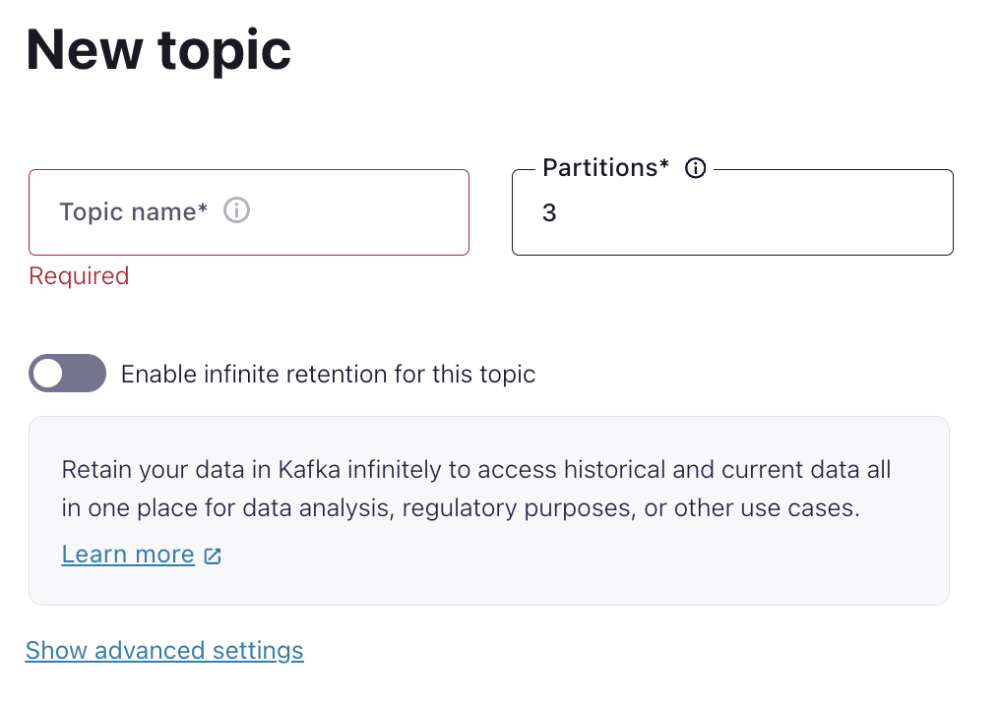
</div>

5. Repeat the previous step and create a second topic name **shoes_clickstream** and **3** as the number of partitions and skip the data contract.

> **Note:** Topics have many configurable parameters. A complete list of those configurations for Confluent Cloud can be found [here](https://docs.confluent.io/cloud/current/using/broker-config.html). If you are interested in viewing the default configurations, you can view them in the Topic Summary on the right side. 

7. After topic creation, the **Topics UI** allows you to monitor production and consumption throughput metrics and the configuration parameters for your topics. When you begin sending messages to Confluent Cloud, you will be able to view those messages and message schemas.

***

## <a name="step-5"></a>Create an API Key

1. Open the cluster page.
2. Click **API Keys** in the menu under *Cluster Overview*.
3. Click **Create Key** in order to create your first API Key. If you have an existing API Key, click **+ Add Key** to create another API Key.

<div align="center" padding=25px>
    
</div>

4. Select **My account** and then click **Next**.
5. Enter a description for your API Key (e.g. `API Key to source data from connectors`).

<div align="center" padding=25px>
    
</div>

6. After creating and saving the API key, you will see this API key in the Confluent Cloud UI in the *API Keys* table. If you don't see the API key populate right away, try refreshing your browser.


## <a name="step-6"></a>Create Datagen Connectors for Shoes Orders and Shoes Clickstream

The next step is to produce sample data using the Datagen Source connector. You will create two Datagen Source connectors.

The first connector will send sample shoe orders data to the **shoes_orders** topic, while the second connector will send shoes clickstream data to the **shoes_clickstream** topic.

1. First, navigate to your workshop cluster.
2. Next, click on the **Connectors** link on the navigation menu.
3. Now click on the **Datagen Source** icon.

<div align="center" padding=25px>
    
</div>

4. Click the **Additional Configuration** link.
5. Enter the following configuration details in the setup wizard. The remaining fields can be left blank or default.
<div align="center">

| Setting                            | Value                        |
|------------------------------------|------------------------------|
| Topic                              | shoes_orders                 |
| API Key                            | [*from step 5*](#step-5)     |
| API Secret                         | [*from step 5*](#step-5)     |
| Output message format              | AVRO                         |
| Quickstart                         | Shoe orders                  |
| Max interval between messages (ms) | 1000                         |
| Tasks                              | 1                            |
| Name                               | shoe-orders-data-connector   |

</div>

<br>

<div align="center" padding=25px>
    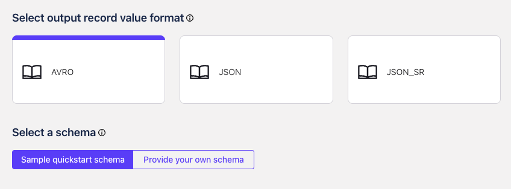
</div>

<div align="center" padding=25px>
    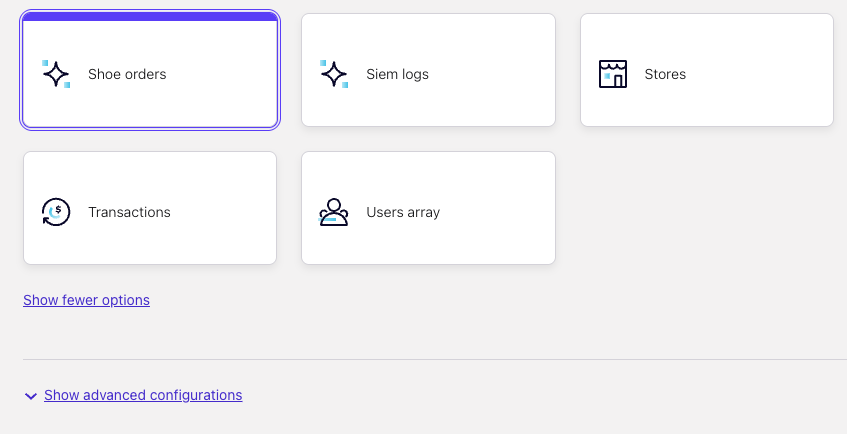
</div>

6. Continue through the setup wizard and click **Continue** to launch the wizard.


7. Next, create the second connector that will send data to **shoes_clickstream**. Click on **+ Add Connector** and then the **Datagen Source** icon again.

8. Enter the following configuration details. The remaining fields can be left blank or default.

<div align="center">

| Setting                            | Value                        |
|------------------------------------|------------------------------|
| Topic                              | shoes_clickstream
| API Key                            | [*from step 5* ](#step-5)    |
| API Secret                         | [*from step 5* ](#step-5)    |
| Output message format              | AVRO                         |
| Quickstart                         | Shoe clickstream             |
| Max interval between messages (ms) | 1000                         |
| Tasks                              | 1                            |
| Name                               | shoe-clicks-data-connector   |
</div>

<br>

9. Review your selections and then click **Launch**.


> **Note:** It may take a few moments for the connectors to launch. Check the status and when both are ready, the status should show *running*. <br> <div align="center">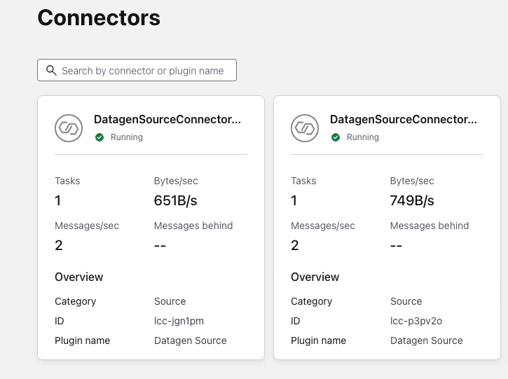</div>

> **Note:** If the connector fails, there are a few different ways to troubleshoot the error:
> * Click on the *Connector Name*. You will see a play and pause button on this page. Click on the play button.
> * Click on the *Connector Name*, go to *Settings*, and re-enter your API key and secret. Double check there are no extra spaces at the beginning or end of the key and secret that you may have accidentally copied and pasted.
> * If neither of these steps work, try creating another Datagen connector.


10. You can view the sample data flowing into topics in real time. Navigate to  the **Topics** tab and then click on the **shoes_orders**. You can view the production and consumption throughput metrics here.

11. Click on **Messages**.
12. Click on a row in the table and you should see something like this:

<div align="center">
    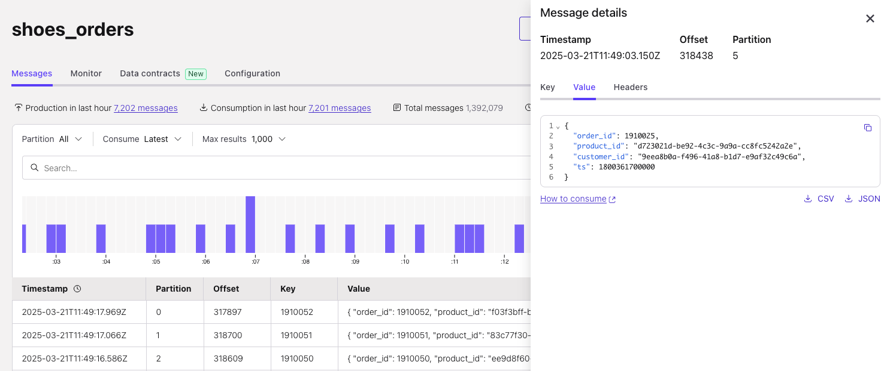
</div>


## <a name="step-7"></a>Create MongoDB Source Connector for shoes and customers details

The next step is to get initial shoes and customer data from MongoDB.

1. First, navigate to your workshop cluster.
2. Next, click on the **Connectors** link on the navigation menu.
3. Click on **Add Connector**
4. Now search for mongo 

<div align="center" padding=25px>
    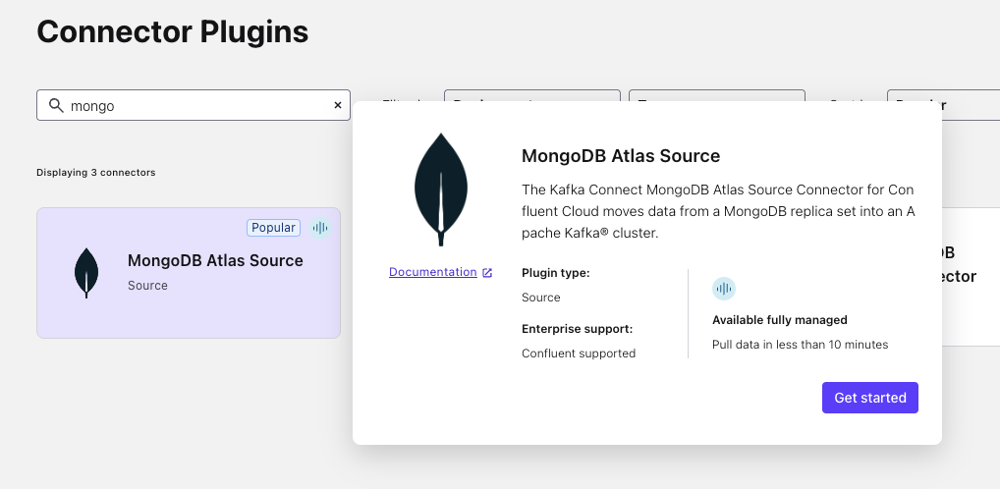
</div>

5. Enter the following configuration details in the setup wizard. The remaining fields can be left blank or default.
<div align="center">

| Setting                            | Value                        |
|------------------------------------|------------------------------|
| Topic prefix                       | mongo                        |
| API Key                            | [*from step 5*](#step-5)     |
| API Secret                         | [*from step 5*](#step-5)     |
| Connection host                    | < MongoDB Server URL >       |
| Connection user                    | < MongoDB Username >         |
| Connection password                | < MongoDB Password >         |
| Database name                      | < MongoDB Database Name >    |
| Output kakfa record value format   | AVRO                         |
| Publish full document only         | true                         |
| Startup mode                       | copy_existing                |
| Tasks                              | 1                            |
| Name                               | MongoDBSourceConnector_Shoes |

**You can use [`shoes.json`](../common/shoes.json) , [`shoe_customers.json`](../common/shoe_customers.json) and upload those in Atlas MongoDB collection.  If Atlas access is not available then MongoDB Connection details will be provided.             
</div>

<br>

6. Review your selections and then click **Launch**.


> **Note:** It may take a few moments for the connectors to launch. Check the status and when both are ready, the status should show *running*. <br> <div align="center">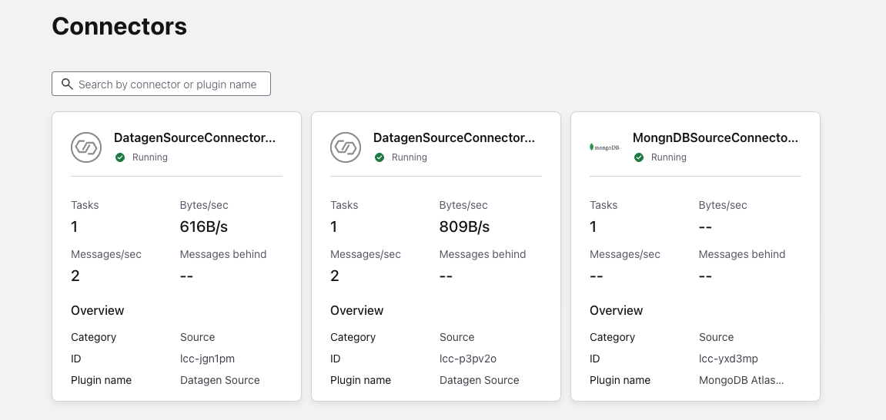</div>

## <a name="step-8"></a>Stream Processing with Flink for getting trendy products, customer segements, and combine the records into one topic

Kafka topics and schemas are always in sync with our Flink cluster. Any topic created in Kafka is visible directly as a table in Flink, and any table created in Flink is visible as a topic in Kafka. Effectively, Flink provides a SQL interface on top of Confluent Cloud.

1. From the Confluent Cloud UI, click on the **Environments** tab on the navigation menu. Choose your environment.
2. Click on **Flink** from the menu pane
3. Choose the compute pool created in the previous steps.
4. Click on **Open SQL workspace** button on the top right.
5. Let's execute the following SQL queries to create the `latest_trends` table, which aggregates the top products and brands within a defined time period, updating every minute.

Let's begin by identifying the top products every minute.

```sql
CREATE TABLE top_products_every_minute ( 
    product_id STRING, 
    view_count BIGINT, 
    avg_view_time DOUBLE, 
    window_start TIMESTAMP_LTZ(3), 
    window_end TIMESTAMP_LTZ(3) 
    );
```

**How can we identify the most popular products over a defined time window?**

Before running below query, we should first explore the raw shoes_clickstream data to understand user interactions. This involves:

- Counting product views per minute to analyze engagement trends.

- Calculating the average time spent on each product to measure interest levels.

- Grouping and ranking them into 1-minute windows to track real-time trends.

Once we understand these metrics, we can proceed with ranking the top 5 products every minute. Let's try now running the below query.

6. Add a new query by clicking on + icon in the left of previous query to Insert records to the above table by running the following query.

```sql
INSERT  INTO top_products_every_minute 
    WITH ProductStats AS ( 
        SELECT product_id, 
        COUNT(*) AS view_count, 
        AVG(view_time) AS avg_view_time, 
        window_start, window_end FROM TABLE( 
        TUMBLE(TABLE shoes_clickstream, DESCRIPTOR(`$rowtime`), INTERVAL '1' MINUTE) 
        ) 
        GROUP BY product_id, window_start, window_end ), 

    RankedProducts AS ( 
        SELECT product_id, view_count, avg_view_time, 
        window_start, window_end, ROW_NUMBER() OVER ( 
        PARTITION BY window_start, window_end ORDER BY view_count DESC, avg_view_time DESC ) AS ranking 
        FROM ProductStats ) 

    SELECT product_id, view_count, avg_view_time, 
    window_start, window_end FROM RankedProducts 
    WHERE ranking <= 5;
```

Next, we will enhance `top_products_every_minute` by adding brand and shoe details. This involves joining with the `shoes` table to retrieve brand and shoe names for the top products. The resulting `top_shoes_with_details` table will offer a comprehensive view of trending products and brands every minute.  

Insert the correct column name for `<PRODUCT_ID_COLUMN>` from `top_products_every_minute`.

```sql
CREATE TABLE top_shoes_with_details (
    `timestamp` TIMESTAMP(3),
    WATERMARK FOR `timestamp` AS `timestamp` - INTERVAL '5' SECOND
) AS 
select *, now () as `timestamp` from top_products_every_minute as tp , 
`mongo.demo.shoes` as ms 
where ms.id=tp.<PRODUCT_ID_COLUMN>;
```

Let's aggregate all the trending brands and shoes over a time window. Insert the correct column name for `<BRAND_COLUMN>` from `top_shoes_with_details` and run the query. 

```sql
CREATE TABLE results_aggregated (
    `timestamp` TIMESTAMP(3),
    WATERMARK FOR `timestamp` AS `timestamp` - INTERVAL '5' SECOND
)  AS
SELECT LISTAGG(`<BRAND_COLUMN>`) OVER w AS `trending_brands`,
        LISTAGG(`name`) OVER w AS `trending_shoes`,
        SUM(view_count) OVER w AS `collective_view_count`,
        `timestamp`
    FROM top_shoes_with_details
  WINDOW w AS (
  PARTITION BY window_start,window_end
  ORDER BY `timestamp`
  RANGE BETWEEN INTERVAL '1' MINUTE PRECEDING AND CURRENT ROW);
```

**Now, Let's Remove Duplicates**  

We'll create the `latest_trends` table by **deduplicating aggregated results**, ensuring only the most recent entry per time window is retained.  
This query assigns a **row number** to each record within the same `window_start` and `window_end`, ordered by `timestamp` (latest first), and keeps only the **latest record** per window. 

```sql
CREATE TABLE latest_trends AS 
    SELECT `trending_brands`,`trending_shoes`, 
    `collective_view_count`, `row_num`,
    window_start,window_end FROM ( 
        SELECT *, ROW_NUMBER() OVER (
        PARTITION BY window_start, window_end ORDER BY `timestamp` DESC) AS row_num 
        FROM TABLE(
        TUMBLE(TABLE `results_aggregated`, DESCRIPTOR(`timestamp`), INTERVAL '1' MINUTE)) ) 
    where row_num<=1;
```

Every customer is unique, and their shopping behavior varies. To provide personalized recommendations, we need to understand their purchasing patterns. So, let's segment our customers based on their recent purchase history, identifying frequent **shoppers**, **emerging buyers**, and **occasional customers**. 

7. Let's segment users based on their purchase frequency in `shoes_orders` to better understand their shopping behavior.Replace the correct table name for `<SHOE_ORDERS_TABLE_NAME>` and run the query. 

```sql
CREATE TABLE customer_segments_table AS 
    SELECT customer_id, `$rowtime` as event_rtime, COUNT(order_id) OVER ( 
    PARTITION BY customer_id ORDER BY `$rowtime` 
    RANGE BETWEEN INTERVAL '5' MINUTE PRECEDING AND CURRENT ROW ) AS orders, 
    CASE 
        WHEN COUNT(order_id) OVER ( 
            PARTITION BY customer_id ORDER BY `$rowtime` 
            RANGE BETWEEN INTERVAL '5' MINUTE PRECEDING AND CURRENT ROW ) > 3 
        THEN 'Frequent Shopper' 
        WHEN COUNT(order_id) OVER ( 
            PARTITION BY customer_id ORDER BY `$rowtime` 
            RANGE BETWEEN INTERVAL '5' MINUTE PRECEDING AND CURRENT ROW ) BETWEEN 2 AND 3 
        THEN 'Emerging Shopper' 
        ELSE 'Occasional Buyer' END AS customer_segment 
    FROM <SHOE_ORDERS_TABLE_NAME>;
```

8. Create the final topic containing all the data needed for Bedrock to generate product recommendations. Replace `<SEGMENTED_TABLE_NAME>` with the correct table name from the previous segmentation query and execute the query.

```sql
CREATE TABLE personalized_recommendation_input AS 
    select * from `<SEGMENTED_TABLE_NAME>` as s , 
    latest_trends as lt 
    where s.event_rtime BETWEEN lt.window_start AND lt.window_end;
```

## <a name="step-9"></a>Consume final topic and recommend shoes to customers with aws bedrock

1. Use confluent UI to create connection with bedrock. Navigate to integrations under environment.

<div align="center" padding=25px>
    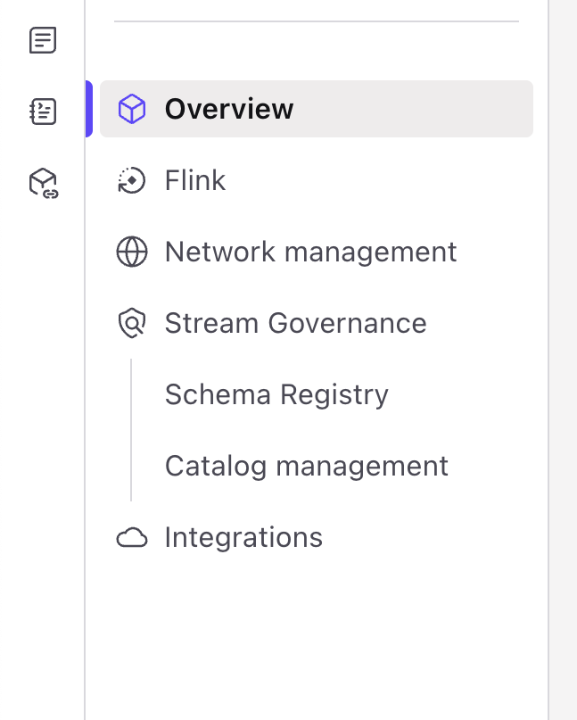
</div>

2. Navigate to connections and add connections.

<div align="center" padding=25px>
    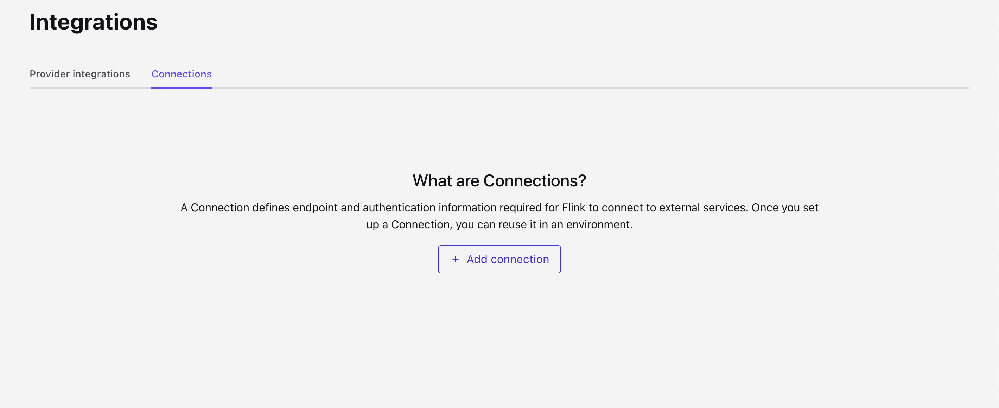
</div>

4. Copy the AWS Credentails from AWS dashboard.

<div align="center" padding=25px>
    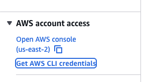
</div>

>**Note:** Alternatively you can create a new AWS user and assign AmazonBedrockFullAccess policy and generate the Key and secret for this user. <br> <div align="center">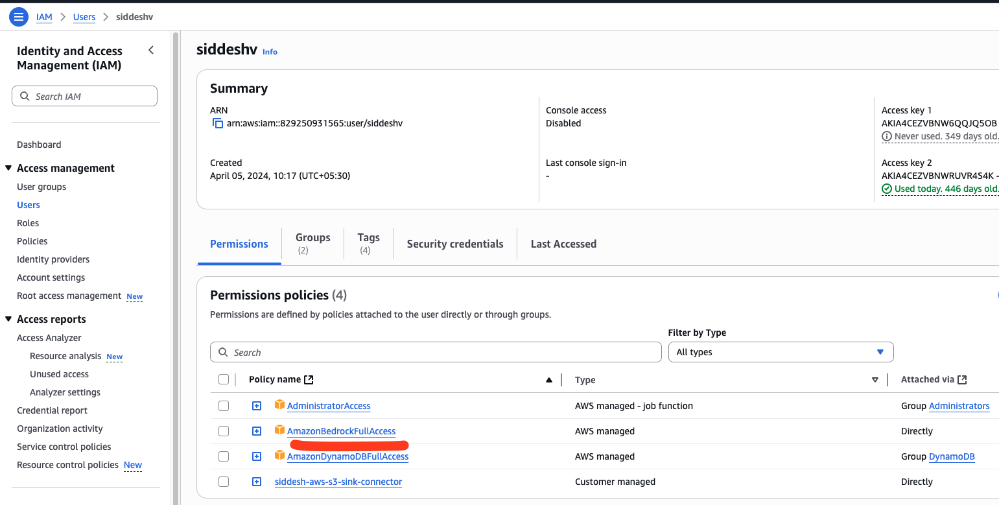</div>

5. Select Bedrock, add above aws credentials and bedrock endpoint url:
    https://bedrock-runtime.us-east-1.amazonaws.com/model/meta.llama3-8b-instruct-v1:0/invoke
    
<div align="center" padding=25px>
    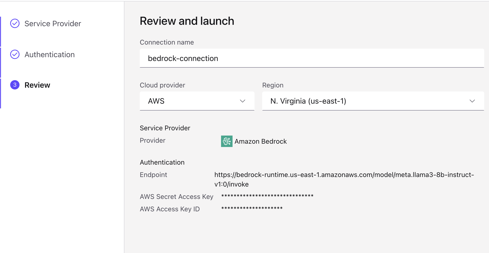
</div>

6. After creating the connection validate if the integration is created sucessfully.

<div align="center" padding=25px>
    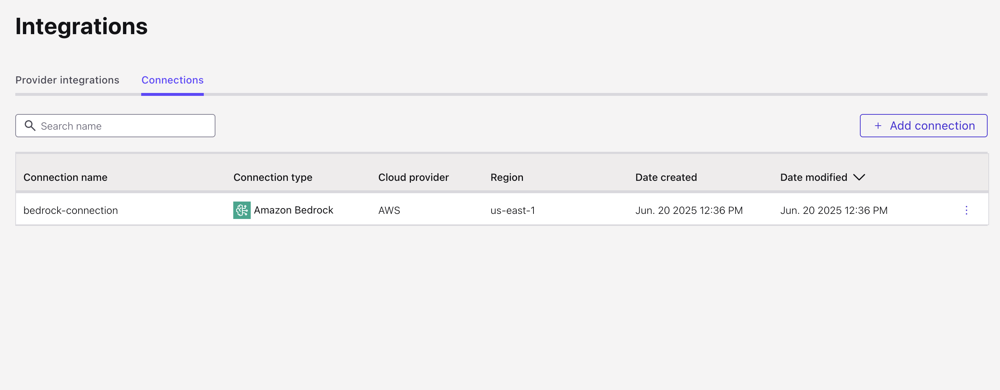
</div>

7. Use the same connection to create a model in flink.

```sql
CREATE MODEL RECOMMEND_BEDROCK
INPUT (`text` VARCHAR(2147483647)) 
OUTPUT (`output` VARCHAR(2147483647)) 
WITH ( 
    'bedrock.connection' = 'bedrock-connection', 
    'bedrock.system_prompt' = 'Generate a personalized product recommendation message',
    'provider' = 'bedrock', 
    'task' = 'text_generation' 
    );
```

8. Use the bedrock model to get shoes/brands recommendation based upon the input gathered in the final topic.

```sql
SELECT * FROM personalized_recommendation_input, 
LATERAL TABLE( 
    ML_PREDICT('RECOMMEND_BEDROCK' ,'Customer Segment:' || customer_segment || 
    ' , Trending Brands:' || trending_brands || 
    ' , Trending Products:' || trending_shoes || 
    ' , \n Craft a concise, engaging message without any input and system level parameters and only give me Recommendation Message, recommending one or two relevant products or brands. Tailor the tone to match the customer’s segment and include a compelling call-to-action to drive engagement. remove any debrock specific headers and give final message which can be shown as a string.')
    );
```

```sql
CREATE TABLE Recommendations AS SELECT customer_id , output FROM personalized_recommendation_input, 
LATERAL TABLE( 
    ML_PREDICT('RECOMMEND_BEDROCK' ,'Customer Segment:' || customer_segment || 
    ' , Trending Brands:' || trending_brands || 
    ' , Trending Products:' || trending_shoes || 
    ' , \n Craft a concise, engaging message without any input and system level parameters and only give me Recommendation Message, recommending one or two relevant products or brands. Tailor the tone to match the customer’s segment and include a compelling call-to-action to drive engagement. remove any debrock specific headers and give final message which can be shown as a string.')
    );  
```

<div align="center">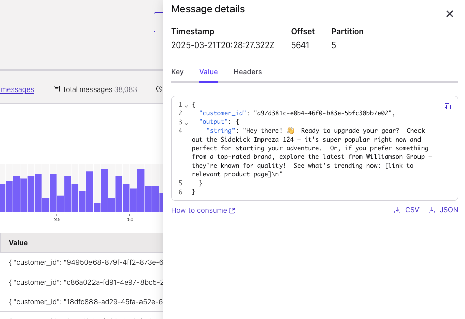</div>

## <a name="step-10"></a>Elasticsearch Monitoring

The next step is to sink topics to elasticsearch for analytics and monitoring.

You can either use Elasticsearch Cloud services or self manage the elasticsearch with docker. Refer [`elk`](elk) for steps.

1. First, navigate to your workshop cluster.
2. Next, click on the **Connectors** link on the navigation menu.
3. Click on **Add Connector**
4. Now search for elastic 

<div align="center" padding=25px>
    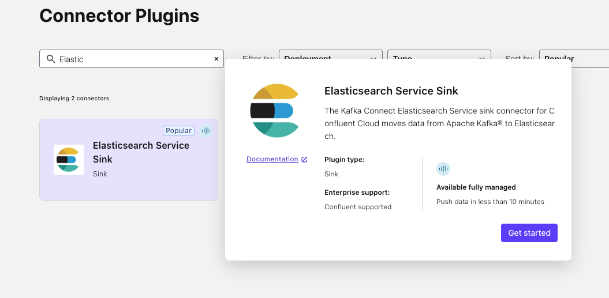
</div>

5. Enter the following configuration details in the setup wizard. The remaining fields can be left blank or default.
<div align="center">

| Setting                            | Value                                               |
|------------------------------------|-----------------------------------------------------|
| Topic names                        | customer_segments_table , top_products_every_minute |
| API Key                            | [*from step 5*](#step-5)                            |
| API Secret                         | [*from step 5*](#step-5)                            |
| Connection URI                     | < Elasticsearch Server URL >                        |
| Connection user                    | < Elasticsearch Username >                          |
| Connection password                | < Elasticsearch Password >                          |
| Input kakfa record value format    | AVRO                                                |
| Key ignore                         | true                                                |
| Tasks                              | 1                                                   |
| Name                               | ElasticsearchSinkConnector_monitoring               |
> **Note:** It may take a few moments for the connectors to launch. Check the status and when both are ready, the status should show *running*. <br>      
</div>

<br>


6. Review your selections and then click **Launch**.

7. Next step is to create Elasticsearch data-views and kibana-dashboard. You can use [`elasticsearch.ndjson`](elasticsearch.ndjson) to import the dashbaord.

8. Now Visit Elasticsearch UI and select Stack Management page under Management from the hamburger menu.
<div align="center" padding=25px>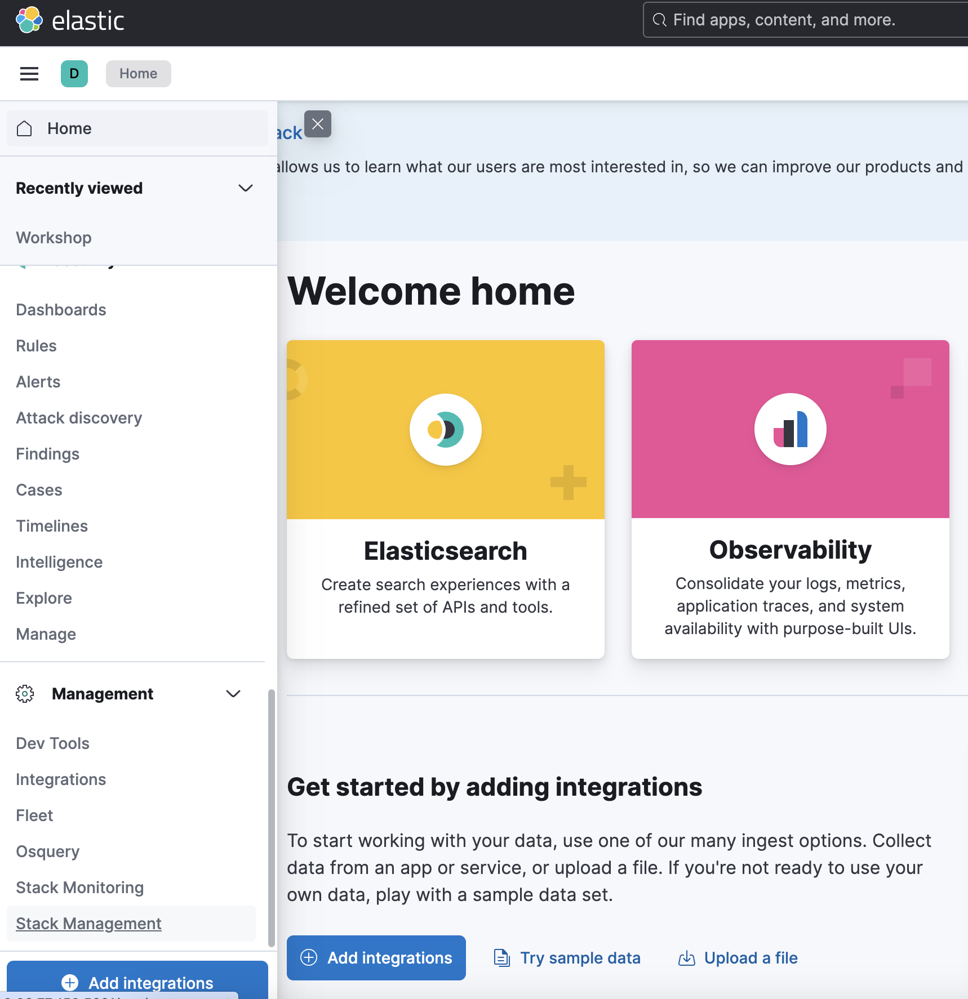</div>

9. Proceed to Saved Objects page under kibana section
<div align="center" padding=25px>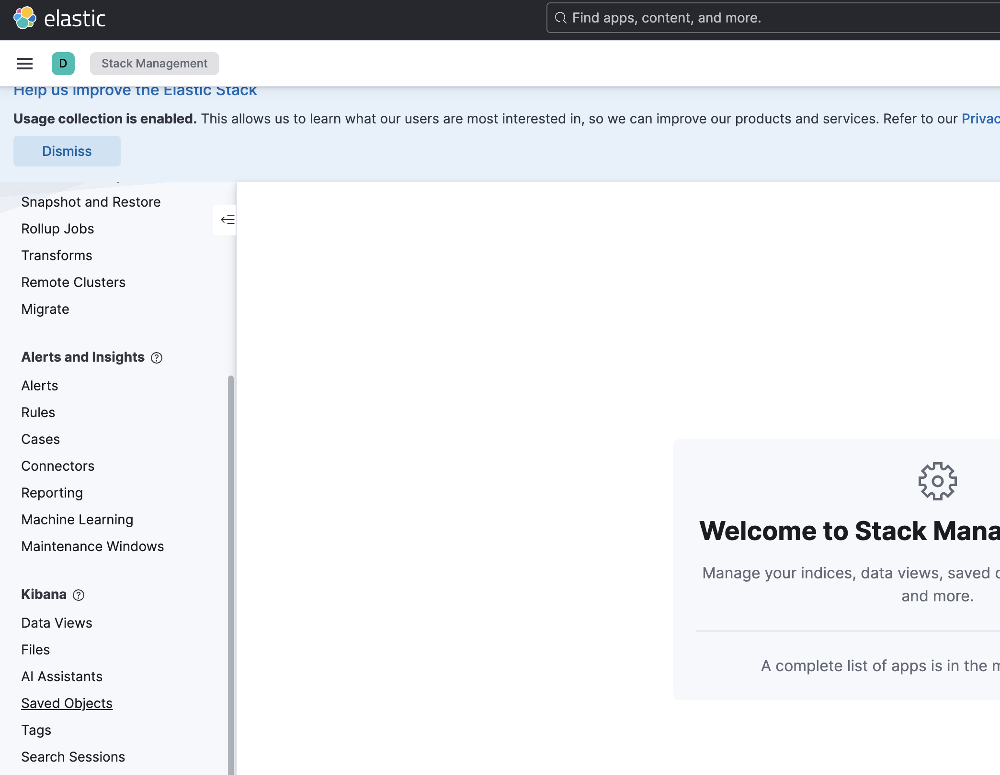</div>

10. Import dashboard template from [`elasticsearch.ndjson`](elasticsearch.ndjson) file.

<div align="center" padding=25px>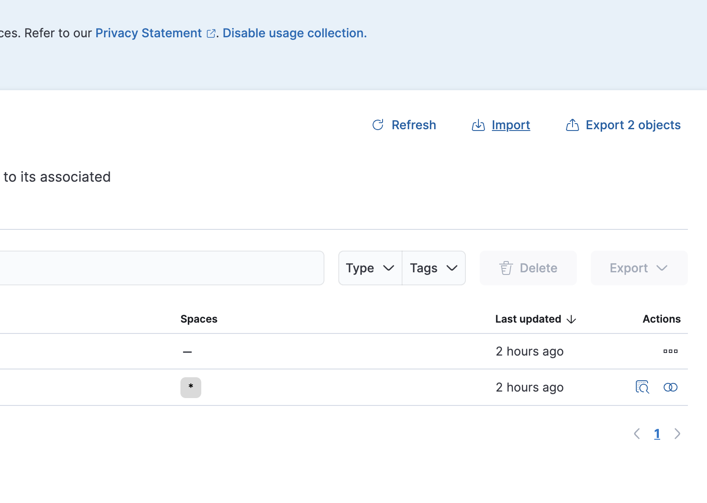</div>
<br>
<div align="center" padding=25px>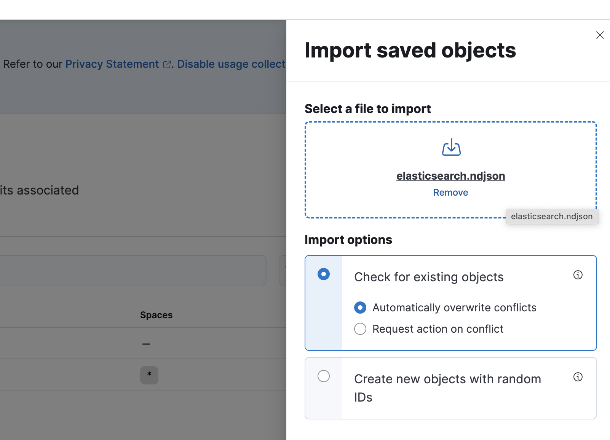</div>
<br>
<div align="center" padding=25px>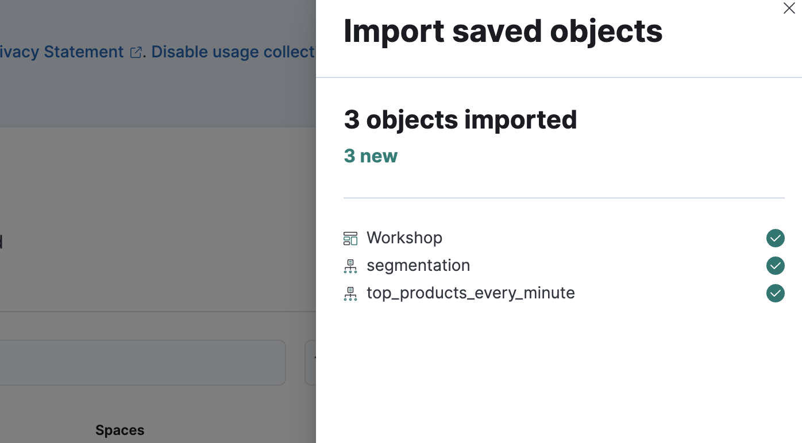</div>

11. Once dashboard imported successfully , visit Dashboards page under Analytics section.

<div align="center" padding=25px>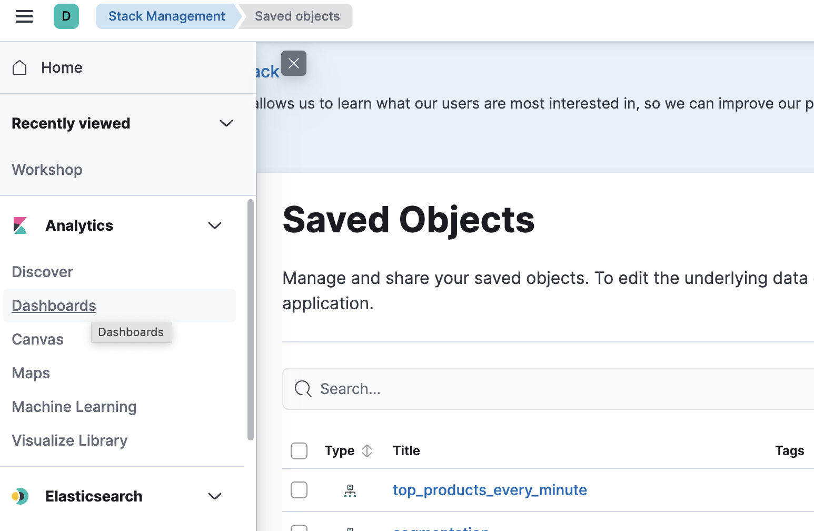</div>
<br>
<div align="center" padding=25px>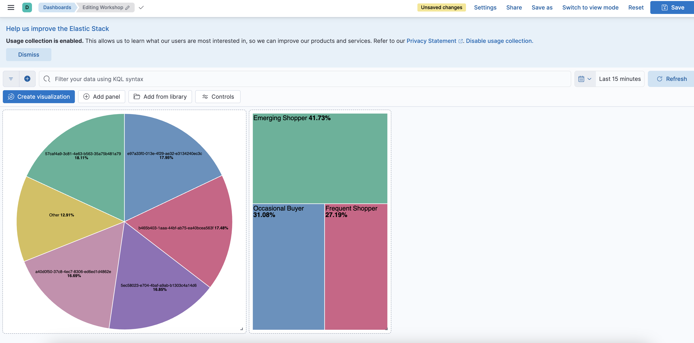</div>

## <a name="step-11"></a>Clean Up Resources

Deleting the resources you created during this workshop will prevent you from incurring additional charges. 

1. The first item to delete is the Apache Flink Compute Pool. Select the **Delete** button under **Actions** and enter the **Application Name** to confirm the deletion. 
<div align="center">
    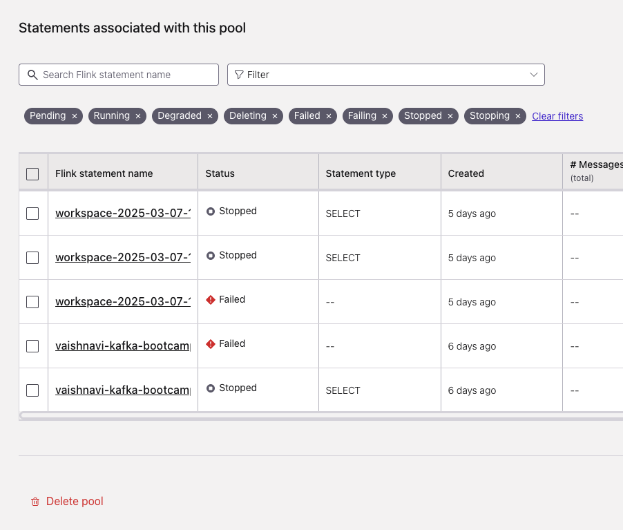
</div>

2. Next, delete all the connectors, Navigate to the **Connectors** tab and select each connector. In the settings tab, you will see a **trash** icon on the bottom of the page. Click the icon and enter the **Connector Name**.
<div align="center">
    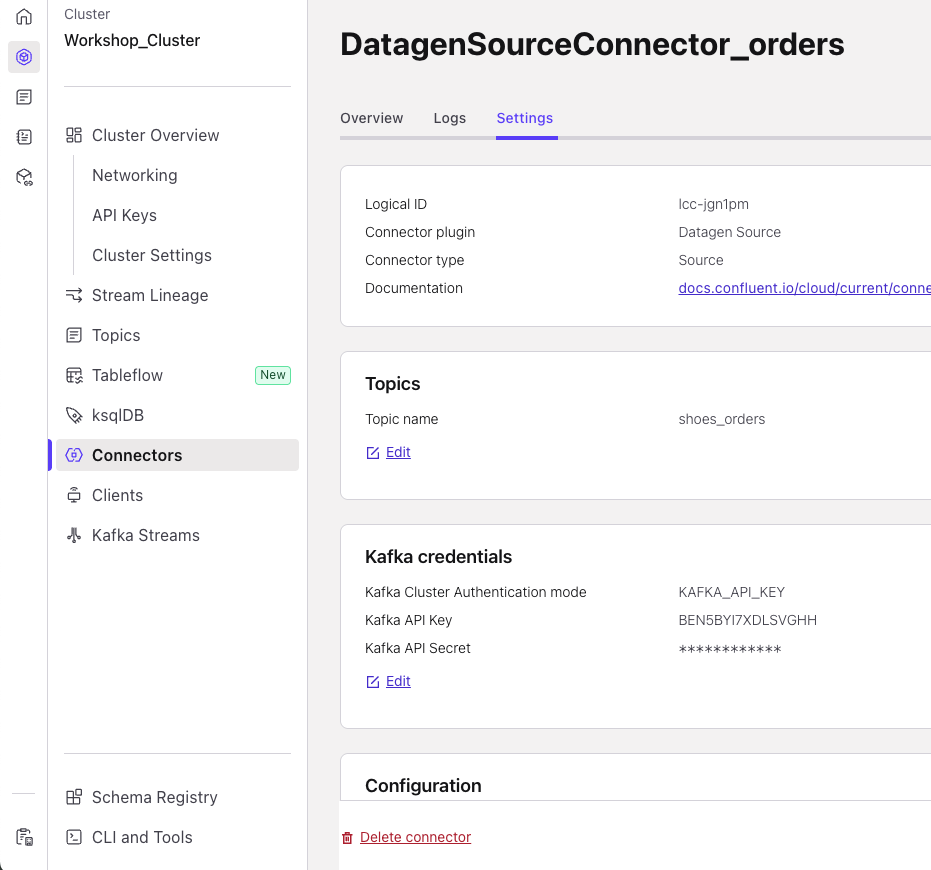
</div>

3. Next, under **Cluster Settings**, select the **Delete Cluster** button at the bottom. Enter the **Cluster Name** and select **Confirm**. 
<div align="center">
    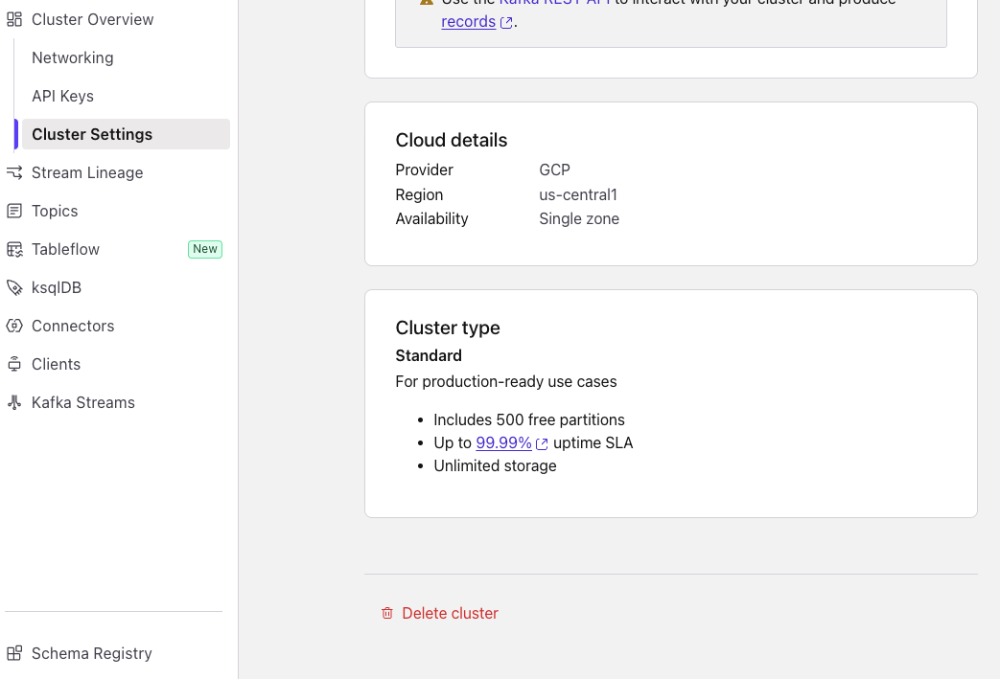
</div>

4. Finally, to remove all resource pertaining to this workshop, delete the environment.
<div align="center">
    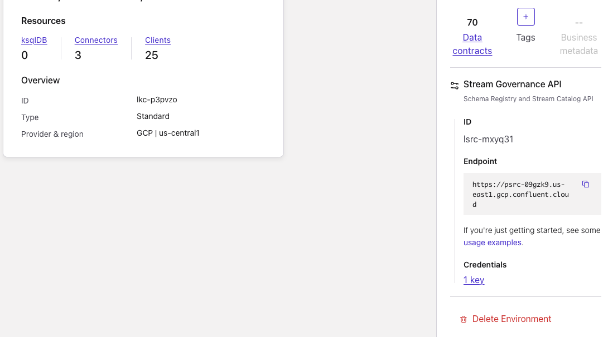
</div>
*** 

## <a name="step-12"></a>Confluent Resources and Further Testing

Here are some links to check out if you are interested in further testing:
- [Confluent Cloud Documentation](https://docs.confluent.io/cloud/current/overview.html)
- [MongoDB Source Connector](https://docs.confluent.io/cloud/current/connectors/cc-mongo-db-source.html)
- [Apache Flink 101](https://developer.confluent.io/courses/apache-flink/intro/)
- [Stream Processing with Confluent Cloud for Apache Flink](https://docs.confluent.io/cloud/current/flink/index.html)
- [Flink SQL Reference](https://docs.confluent.io/cloud/current/flink/reference/overview.html)
- [Flink SQL Functions](https://docs.confluent.io/cloud/current/flink/reference/functions/overview.html)
- [Flink GenAI](https://www.confluent.io/blog/flinkai-realtime-ml-and-genai-confluent-cloud/)
- [Elasticsearch Sink Connector](https://docs.confluent.io/cloud/current/connectors/cc-elasticsearch-service-sink.html)

***


